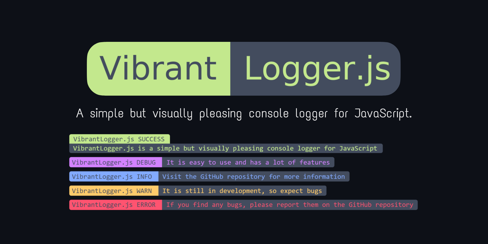

# Vibrant-Logger.js

A very simple but visually pleasing console logger for JavaScript.

## Table of Contents

- [Vibrant-Logger.js](#vibrant-loggerjs)
  - [Table of Contents](#table-of-contents)
  - [Features](#features)
  - [Variants](#variants)
  - [License](#license)

## Features

- :art: Beautiful colors
- :sparkles: Easy to use
- :zap: Tiny size
- :wrench: Customizable
- :tada: No dependencies

## Variants

There are 2 different variants of this project:

- [VibrantLogger.js](Vibrant-Logger.md) **(recommended)** - The full version of the library, perfect for any project. It requires some setup and is design to be included in your project.
- [TinyLogger.js](Tiny-Logger.md) - The stripped down version of the library, perfect for tiny projects. It doesn't require any setup and is design to be pasted directly into your project.

## License

This project is licensed under the MIT License - see the [LICENSE](LICENSE) file for details.
